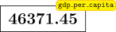
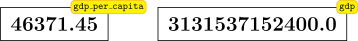
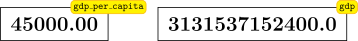

::::::::::::::::::::::::::::::::::::::: objectives

- Assign values to variables.

::::::::::::::::::::::::::::::::::::::::::::::::::

:::::::::::::::::::::::::::::::::::::::: questions

- What basic data types can I work with in Python?
- How can I create a new variable in Python?
- How do I use a function?
- Can I change the value associated with a variable after I create it?

::::::::::::::::::::::::::::::::::::::::::::::::::

## Variables

Any Python interpreter can be used as a calculator:

```python
3 + 5 * 4
```

```output
23
```

This is great but not very interesting.
To do anything useful with data, we need to assign its value to a *variable*.
In Python, we can [assign](../learners/reference.md#assign) a value to a
[variable](../learners/reference.md#variable), using the equals sign `=`.
For example, the GDP per capita of the UK is approximately $46510.
We could track this by assigning the value `46510` to a variable `gdp_per_capita`:

```python
gdp_per_capita = 46_510
```

From now on, whenever we use `gdp_per_capita`, Python will substitute the value we assigned to it.
In layperson's terms, **a variable is a name for a value**.

In Python, variable names:

- can include letters, digits, and underscores
- cannot start with a digit
- are [case sensitive](../learners/reference.md#case-sensitive).

This means that, for example:

- `gdp_per_capita_2021` is a valid variable name, whereas `2021_gdp_per_capita` is not.
- `gdp_per_capita` and `GDP_per_capita` are different variables.

## Types of data

Python knows various types of data. 
Three common ones are:

- integer numbers,
- floating point numbers, and
- strings.

In the example above, variable `gdp_per_capita` has an integer value of `46510`.
If we want to more precisely track the GDP of the UK, we can use a floating point value by executing:

```python
gdp_per_capita = 46_510.28
```

To create a string, we add single or double quotes around some text.
We could track the [language code](https://en.wikipedia.org/wiki/List_of_ISO_639-1_codes) of a country by storing it as a string: 

```python
uk_language_code = 'eng'
```

## Using Variables in Python

Once we have data stored with variable names, we can make use of it in calculations.
We may want to store our country's raw GDP value as well as the GDP per capita:

```python
gdp = 67_330_000.0 * gdp_per_capita
```

We also might decide to add a prefix to our language identifier:

```python
uk_language_code = 'ISO_' + uk_language_code
```

## Built-in Python functions

To carry out common tasks with data and variables in Python, the language provides us with several built-in [functions](../learners/reference.md#function).
To display information to the screen, we use the `print` function:

```python
print(gdp_per_capita)
print(uk_language_code)
```

```output
46510.28
ISO_eng
```

When we want to make use of a function, referred to as calling the function, we follow its name by parentheses.
The parentheses are important: if you leave them off, the function doesn't actually run!
Sometimes you will include values or variables inside the parentheses for the function to use.
In the case of `print`, we use the parentheses to tell the function what value we want to display.
We will learn more about how functions work and how to create our own in later episodes.

We can display multiple things at once using only one `print` call:

```python
print(uk_language_code, 'GDP per capita is USD $', gdp_per_capita)
```

```output
ISO_eng GDP per capita is USD $ 46510.28
```

We can also call a function inside of another [function call](../learners/reference.md#function-call).
For example, Python has a built-in function called `type` that tells you a value's data type:

```python
print(type(gdp_per_capita))
print(type(uk_language_code))
```

```output
<class 'float'>
<class 'str'>
```

Moreover, we can do arithmetic with variables right inside the `print` function:

```python
print('GDP in USD $', 67_330_000.0 * gdp_per_capita)
```

```output
GDP in USD $ 3131537152400.0
```

The above command, however, did not change the value of `gdp_per_capita`:

```python
print(gdp_per_capita)
```

```output
46510.28
```

To change the value of the `gdp_per_capita` variable, we have to
**assign** `gdp_per_capita` a new value using the equals `=` sign:

```python
gdp_per_capita = 46_371.45
print('GDP per capita is now:', gdp_per_capita)
```

```output
GDP per capita is now: 46371.45
```

:::::::::::::::::::::::::::::::::::::::::  callout

## Variables as Sticky Notes

A variable in Python is analogous to a sticky note with a name written on it: assigning a value to a variable is like putting that sticky note on a particular value.

{alt='Value of 46371.45 with gdp\_per\_capita label stuck on it'}

Using this analogy, we can investigate how assigning a value to one variable does **not** change values of other, seemingly related, variables.
For example, let's store the country's GDP in its own variable:

```python
# There are 67330000 people in the UK
gdp = 67330000 * gdp_per_capita
print('GDP per capita: USD $', gdp_per_capita, 'Raw GDP: USD $', gdp)
```

```output
GDP per capita: USD $ 46371.45 Raw GDP: USD $ 3122189728500.0
```

Everything in a line of code following the '#' symbol is a [comment](../learners/reference.md#comment) that is ignored by Python.
Comments allow programmers to leave explanatory notes for other programmers or their future selves.

{alt='Value of 46371.45 with gdp\_per\_capita label stuck on it, next to a value of 3.13 trillion with gdp label stuck on it.'}

Similar to above, the expression `67_330_000 * gdp_per_capita` is evaluated to `3122189728500.0`, and then this value is assigned to the variable `gdp` (i.e. the sticky note `gdp` is placed on `3122189728500.0`).
At this point, each variable is "stuck" to completely distinct and unrelated values.

Let's now change `gdp_per_capita`:

```python
gdp_per_capita = 45_000.00
print('GDP per capita is now: USD $', gdp_per_capita, 'But raw GDP is still: USD $', gdp)
```

```output
GDP per capita is now: USD $ 45000.0 But raw GDP is still: USD $ 3122189728500.0
```

{alt='Value of 45000.00 with gdp\_per\_capita label stuck on it, next to a value of 3.13 trillion with gdp label stuck on it.'}

Since `gdp` doesn't "remember" where its value comes from,
it is not updated when we change `gdp_per_capita`.


::::::::::::::::::::::::::::::::::::::::::::::::::

:::::::::::::::::::::::::::::::::::::::  challenge

## Check Your Understanding

What values do the variables `mass` and `age` have after each of the following statements?
Test your answer by executing the lines.

```python
mass = 47.5
age = 122
mass = mass * 2.0
age = age - 20
```

:::::::::::::::  solution

## Solution

```output
`mass` holds a value of 47.5, `age` does not exist
`mass` still holds a value of 47.5, `age` holds a value of 122
`mass` now has a value of 95.0, `age`'s value is still 122
`mass` still has a value of 95.0, `age` now holds 102
```

:::::::::::::::::::::::::

::::::::::::::::::::::::::::::::::::::::::::::::::

:::::::::::::::::::::::::::::::::::::::  challenge

## Sorting Out References

Python allows you to assign multiple values to multiple variables in one line by separating
the variables and values with commas. What does the following program print out?

```python
first, second = 'Grace', 'Hopper'
third, fourth = second, first
print(third, fourth)
```

:::::::::::::::  solution

## Solution

```output
Hopper Grace
```

:::::::::::::::::::::::::

::::::::::::::::::::::::::::::::::::::::::::::::::

:::::::::::::::::::::::::::::::::::::::  challenge

## Seeing Data Types

What are the data types of the following variables?

```python
planet = 'Earth'
apples = 5
distance = 10.5
```

:::::::::::::::  solution

## Solution

```python
print(type(planet))
print(type(apples))
print(type(distance))
```

```output
<class 'str'>
<class 'int'>
<class 'float'>
```

:::::::::::::::::::::::::

::::::::::::::::::::::::::::::::::::::::::::::::::


:::::::::::::::::::::::::::::::::::::::: keypoints

- Basic data types in Python include integers, strings, and floating-point numbers.
- Use `variable = value` to assign a value to a variable in order to record it in memory.
- Variables are created on demand whenever a value is assigned to them.
- Use `print(something)` to display the value of `something`.
- Use `# some kind of explanation` to add comments to programs.
- Built-in functions are always available to use.

::::::::::::::::::::::::::::::::::::::::::::::::::


