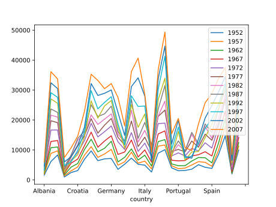
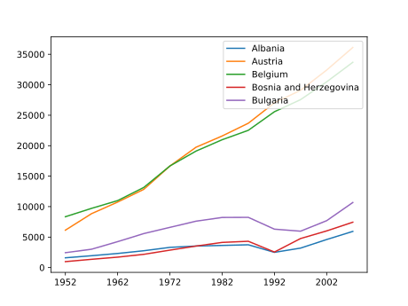
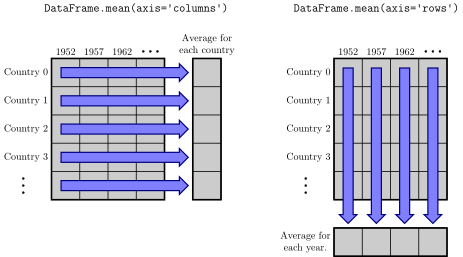
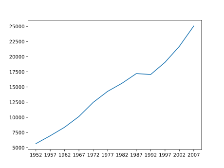
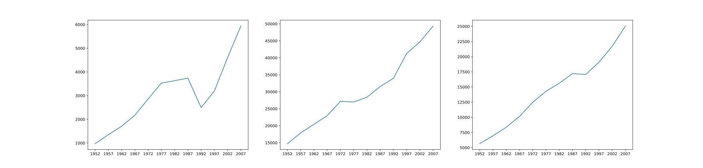
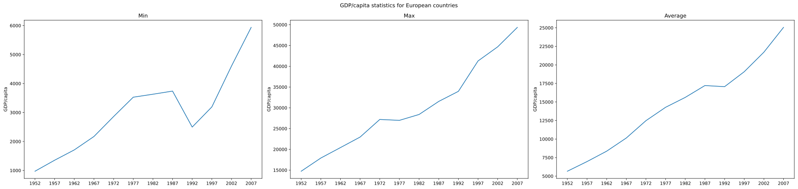

::::::::::::::::::::::::::::::::::::::: objectives

- Plot simple graphs from data.
- Plot multiple graphs in a single figure.

::::::::::::::::::::::::::::::::::::::::::::::::::

:::::::::::::::::::::::::::::::::::::::: questions

- How can I visualize tabular data in Python?
- How can I group several plots together?

::::::::::::::::::::::::::::::::::::::::::::::::::

## Visualizing data

The mathematician Richard Hamming once said, "The purpose of computing is insight, not numbers," and the best way to develop insight is often to visualize data.  Visualization deserves an entire lecture of its own, but we can explore a few features of Python's `matplotlib` library here.
While there is no official plotting library, `matplotlib` is the *de facto* standard.

::::::::::::::::::::::::::::::::::::::::::  prereq

## Episode Prerequisites

Before we can start plotting, we need to load the data from one of our files to use as an example.
Start a new notebook and import the GDP data for Europe into a dataframe called `data_eu`.

```python
import pandas as pd

data_eu = pd.read_csv('data/gapminder_gdp_europe.csv', index_col='country')
```

::::::::::::::::::::::::::::::::::::::::::::::::::

Countries are grouped into files by continent.
Each country has its Gross Domestic Product (GDP) per capita (population) recorded in 5 year intervals from 1952 to 2007.

Dataframes have a `.plot()` method which we can use to produce a line-plot of the data contained within the frame.

```python
data_eu.plot()
```

{alt='A line graph showing the GDP of each country in Europe between 1952 and 2007. Unhelpfully, the dependant variable has been assumed to be the column headers, rather than the rows.'}

This has placed all of our data into a single plot that Python has then displayed to us - clearly, there is far too much here for us to take in!
You might notice that Pandas has assumed we want to use the row labels as the dependant variable for our plot, and the column headers as the line-labels.
In our case however, we want to display the GDP per capital over time, using one line for each country.
We can fix these problems by combining two of the methods we saw in the previous episode;
- We can use an (index) slice to take only the first 5 countries, for example.
- We can transpose our dataframe to reverse the roles of our rows and columns, so `plot` uses the columns as the dependant variable and the rows as the line labels.

```python
first_five_countries = data_eu.iloc[0:5, :]
first_five_countries.T.plot()
```

{alt='A line graph showing the GDP per capita of 5 European countries, from 1952 through to 2007.'}

## Computing statistics across dataframe axes

Let's begin our analysis of the data by plotting the average GDP across Europe, as a function of time.
Pandas dataframes have a built-in function, `mean()` that we can use to help us here:

```python
print(data_eu.mean())
```

```output
1952     5661.057435
1957     6963.012816
1962     8365.486814
1967    10143.823757
1972    12479.575246
1977    14283.979110
1982    15617.896551
1987    17214.310727
1992    17061.568084
1997    19076.781802
2002    21711.732422
2007    25054.481636
dtype: float64
```

You'll notice that Pandas has assumed (again) that we want to get the mean for each year, or to "take the mean GDP down the columns".
However it may also be useful to know the average GDP for each country - in which case we want to take the average "along the rows" instead.

We could use the transpose method to reverse the roles of our rows and columns like we did before, and *then* take the average.
Alternatively, `mean()` (and many other dataframe functions) take an optional parameter called `axis` which lets us specify which axis of the dataframe (rows or columns) to take the average along.

Using the `axis` keyword, we can retrieve the average GDP for each country by taking the average value *across the columns* (by setting the argument `axis='columns'` to the `mean` method):

```python
data_eu.mean(axis='columns')
```

```output
country
Albania                    3255.366633
Austria                   20411.916279
Belgium                   19900.758072
...                                ...
Switzerland               27074.334405
Turkey                     4469.453380
United Kingdom            19380.472986
dtype: float64
```
{alt='Diagram illustrating how the axis keyword changes the axis along which the mean() function operates.'}


## Plotting statistics

The `plot` method called directly from our dataframe is implicitly using `matplotlib`'s `pyplot.plot` function.
Whilst calling `plot` directly from a dataset can be helpful to get a quick visual glimpse of the data, most of the time we will want to manipulate our data in some way and plot some significant statistics or derived values, rather than the raw data itself.
We will use the `matplotlib` library to manage and create plots ourselves from here on.
As with any library, we must first tell Python to import it:

```python
import matplotlib.pyplot as plt
```

We can now create a plot of the average GDP of European countries in the following way:

```python
fig = plt.figure()
mean_gdp_each_year = data_eu.mean(axis='rows')
plt.plot(mean_gdp_each_year)
plt.show()
```

{alt='A line graph showing the change in the average GDP of European countries.'})

Let's break down what each line is doing.

First, we use the `figure` function from the `matplotlib.pyplot` library to create a new, blank figure canvas.
The variable `fig` can be used to access this figure canvas.

```python
fig = plt.figure()
```

Then, we create a new variable `mean_gdp_each_year`, with the average value of our `data_eu` dataframe across the rows (down the columns).

```python
mean_gdp_each_year = data_eu.mean(axis='rows')
```

Next, using the `plot` function from the `matplotlib.pyplot` library, we request to visualise the data stored in `mean_gdp_each_year` into the figure canvas.
If we had multiple figures open, we could specify which one to plot this data on. But since we only have one (`fig`), `plt.plot` knows to plot the data onto this one.
Finally, `plt.show()` function displays the final result on the screen.

```python
plt.plot(mean_gdp_each_year)
plt.show()
```

## Grouping Plots

So far, `matplotlib`'s plot hasn't done much more than dataframe's `plot` function did - but that changes now.
It is often the case where we will want to display multiple statistics side-by-side, or the same statistic from multiple datasets simultaneously for comparison purposes.
This can be achieved by adding *subplots* to a figure, using the `add_subplots` function.
Let's demonstrate how to do this by plotting the maximum and minimum GDP of countries in Europe for each year alongside the average GDP for that year.

To achieve this we will need:
1. to compute the min, max, and average GDP each year for European countries;
1. Create a new figure with the right canvas proportions;
1. Generate different subplots ("axes") where to plot the data; and
1. Display the data in the screen.

```python
eu_min_data = data_eu.min(axis='rows')
eu_max_data = data_eu.max(axis='rows')
eu_avg_data = data_eu.mean(axis='rows')

fig = plt.figure(figsize=(10., 3.))

axes_1 = fig.add_subplot(1, 3, 1)
axes_1.plot(eu_min_data)

axes_2 = fig.add_subplot(1, 3, 2)
axes_2.plot(eu_max_data)

axes_3 = fig.add_subplot(1, 3, 3)
axes_3.plot(eu_avg_data)

plt.show()
```

{alt='A figure which contains three subplots, side-by-side'}

Note how we've set the right axis arguments when computing the different statistical properties (`axis='rows'`).
The parameter `figsize` tells Python how big to make this space in relative units. In this case the width is a bit larger than three times the height.
Each subplot is placed into the figure using its `add_subplot` [method](../learners/reference.md#method).
The `add_subplot` method takes 3 parameters. The first denotes how many total rows of subplots there are, the second parameter refers to the total number of subplot columns, and the final parameter denotes which subplot your variable is referencing (left-to-right, top-to-bottom).
Each subplot is stored in a different variable (`axes_1`, `axes_2`, `axes_3`).
Once a subplot is created, the axes can be used to place the desired plot for each.


::::::::::::::::::::::::::::::::::::::::::::::: callout

## `min` and `max` methods

The `min` and `max` functions can be used on a dataframe in the same way as the `mean` function, and take the same `axis` parameter.
For us, this retrieves the minimum GDP of countries in Europe for each year:

```python
data_eu.min(axis='rows')
```

```output
1952     973.533195
1957    1353.989176
1962    1709.683679
1967    2172.352423
1972    2860.169750
1977    3528.481305
1982    3630.880722
1987    3738.932735
1992    2497.437901
1997    3193.054604
2002    4604.211737
2007    5937.029526
dtype: float64
```

:::::::::::::::::::::::::::::::::::::::::::::::::::::::

## Adding labels

Just because we have plotted some statistics doesn't mean our plot is complete!
- There are no axis labels telling us what each subplot is showing us.
- There's no title for the plot.
- There's a lot of whitespace (empty space) surrounding our plot, and between our subplots.

We can fix these using some more `matplotlib` functions.
- The `set_ylabel` method lets us add a label for the y-axis of any plot or subplot, using dot notation.
- The `set_title` method lets us add a title to a subplot.
- The `suptitle` method lets us add a title to the figure window ("super"-title).
- The `tight_layout` method tells `matplotlib` to remove as much whitespace as possible from our figure.

Putting it all together:

```python
eu_min_data = data_eu.min(axis='rows')
eu_max_data = data_eu.max(axis='rows')
eu_avg_data = data_eu.mean(axis='rows')

fig = plt.figure(figsize=(10., 3.))

axes_1 = fig.add_subplot(1, 3, 1)
axes_1.plot(eu_min_data)
axes_1.set_ylabel('GDP/capita')
axes_1.set_title('Min')

axes_2 = fig.add_subplot(1, 3, 2)
axes_2.plot(eu_max_data)
axes_2.set_ylabel('GDP/capita')
axes_1.set_title('Max')

axes_3 = fig.add_subplot(1, 3, 3)
axes_3.plot(eu_avg_data)
axes_3.set_ylabel('GDP/capita')
axes_1.set_title('Average')

fig.suptitle('GDP/capita statistics for European countries')
fig.tight_layout()

plt.show()
```

{alt='A figure with 3 subplots, each labelled with the statistic that they display.'}

::::::::::::::::::::::::::::::::::::::::::::: challenge

## Setting limits for the axes

You might have noticed that our subplots leave a little bit of space between our line and the edges of the subplot itself, which is a result of the range of the y-axis being slightly bigger than the maximum and minimum range of the data we are plotting.

Can you figure out a way to manually set the range of the y-axis, to remove this white space?

Hint:
- Try using the `set_ylim(min_value, max_value)` method on the subplots.
- Try using the `max()` and `min()` methods on the `eu_min_data` variables.

:::::::::::::::: solution

To fix this for the first subplot, we can set the y-axis limits to the overall minimum and maximum values of the dataframe.

```python
axes_1 = fig.add_subplot(1, 3, 1)
axes_1.plot(eu_min_data)
axes_1.set_ylabel('GDP/capita')
axes_1.set_title('Min')

# Sets the y-limits to the min/max overall values to ease comparisson across the plots
y_axes_min_value = eu_min_data.min()
y_axes_max_value = eu_max_data.max()
axes_1.set_ylim(y_axes_min_value, y_axes_max_value)
```

Or without creating intermediate variables, you could use

```python
axes_1.set_ylim(eu_min_data.min(), eu_min_data.max())
```

instead of the last three lines!

:::::::::::::::::::::::::

:::::::::::::::::::::::::::::::::::::::::::::::::::::::

::::::::::::::::::::::::::::::::::::::::::::  challenge

## Drawstyles

The `plot` method doesn't just draw straight, blue lines - it can be customised with some optional parameters.

Modify your calls to `plot` with different parameters to create different line styles in each of the three subplots.
Some useful parameters to add to `plot` are:
- `linestyle = ':'`. Can also be tried with `'--'`, `'-.'`, and a few other options.
- `color = 'red'`. Several other colours are also available!
- `marker = 'x'`. There are [lots of different plotting markers](https://matplotlib.org/stable/api/markers_api.html) to try out.

:::::::::::::::  solution

## Solution

There are a ton of options to pick from here, but an example that draws a dashed, red line with crosses marking the datapoints is below:

```python
axes_1.plot(eu_mean_data, linestyle=':', color='red', marker='x')
```

:::::::::::::::::::::::::

:::::::::::::::::::::::::::::::::::::::::::::::::::::::

::::::::::::::::::::::::::::::::::::::::::::  challenge

## Make Your Own Plot

Create a plot showing the standard deviation of the GDP/captia for each year.

Hint:
- Try using the `std` method on `data_eu`.

:::::::::::::::  solution

## Solution

```python
std_plot = plt.figure()

std_data = data_eu.std(axis='rows')

plt.plot(std_data)
plt.show()
```

:::::::::::::::::::::::::

:::::::::::::::::::::::::::::::::::::::::::::::::::::::

::::::::::::::::::::::::::::::::::::::::::::: challenge

## Moving Plots Around

Modify the program to display the three plots on top of one another instead of side by side.

:::::::::::::::  solution

## Solution

```python
eu_min_data = data_eu.min(axis='rows')
eu_max_data = data_eu.max(axis='rows')
eu_avg_data = data_eu.mean(axis='rows')

fig = plt.figure(figsize=(10., 3.))

axes_1 = fig.add_subplot(3, 1, 1)
axes_1.plot(eu_min_data)
axes_1.set_ylabel('GDP/capita')
axes_1.set_title('Min')

axes_2 = fig.add_subplot(3, 1, 2)
axes_2.plot(eu_max_data)
axes_2.set_ylabel('GDP/capita')
axes_1.set_title('Max')

axes_3 = fig.add_subplot(3, 1, 3)
axes_3.plot(eu_avg_data)
axes_3.set_ylabel('GDP/capita')
axes_1.set_title('Average')

fig.suptitle('GDP/capita statistics for European countries')
fig.tight_layout()

plt.show()
```


:::::::::::::::::::::::::

What would you change to make each of these plots of a similar width than when they were side by side?

:::::::::::::::  solution

## Solution

Change the figure size to be taller than wider.

```python
fig = plt.figure(figsize=(3., 10.))
```
:::::::::::::::::::::::::


:::::::::::::::::::::::::::::::::::::::::::::::::::::::

:::::::::::::::::::::::::::::::::::::::  challenge

## Change In GDP

The GDP data is *longitudinal* in the sense that each row represents a
series of observations relating to one country.  This means that
the change in GDP over time is a meaningful concept.
Let's find out how to calculate changes in the data contained in an array
with pandas.

The `DataFrame.diff()` function takes an array and returns the differences
between two successive values, depending of the axis requested.

Let's use it to examine the changes each year across the ages for Portugal.

```python
portugal = data_eu.loc['Portugal']
print(portugal)
```

```output
1952     3068.319867
1957     3774.571743
1962     4727.954889
 ...             ...
1997    17641.031560
2002    19970.907870
2007    20509.647770
Name: Portugal, dtype: float64
```

Calling `portugal.diff()` would do the following calculations

```python
[ 3068.31 - NaN, 3774.57 - 3068.31,  4727.95 - 3774.57, ...,  19970.90 - 17641.03, 20509.64 - 19970.90 ]
```

and return the 12 difference values in a new series.

```python
portugal.diff()
```

```output
1952            NaN
1957     706.251876
1962     953.383146
 ...            ...
1997    1433.764930
2002    2329.876310
2007     538.739900
Name: Portugal, dtype: float64
```

Note that the first value is NaN because can't substract a value to the first element.

When calling `DataFrame.diff` with a 2-dimensional dataframe, an `axis` argument may be passed to
the function to specify which axis to process. When applying `DataFrame.diff` to our 2D GDP
dataframe, which axis would we specify to obtain differences between the same country?

:::::::::::::::  solution

## Solution

Since the row axis (0) is countries, it does not make sense to get the
difference between two arbitrary countries. The column axis (1) is in
years, so the difference is the change in GDP -- a meaningful
concept.

```python
data_eu.diff(axis=1)
```

:::::::::::::::::::::::::

How would you find the largest change in GDP for each country? Does
it matter if the change in inflammation is an increase or a decrease?

:::::::::::::::  solution

## Solution

By using the `DataFrame.max()` function after you apply the `Dataframe.diff()`
function, you will get the largest difference between days.

```python
data_eu.diff(axis=1).max(axis=1)
```

```output
country
Albania                   1411.157133
Austria                   3827.023200
Belgium                   3523.102370
...                               ...
Switzerland               4228.968720
Turkey                    1950.190666
United Kingdom            3724.262090
dtype: float64
```

If GDP values *decrease* along an axis, then the difference from
one element to the next will be negative. If
you are interested in the **magnitude** of the change and not the
direction, the `DataFrame.abs()` function will provide that.

Notice the difference if you get the largest *absolute* difference
between readings.

```python
data_eu.diff(axis=1).abs().max(axis=1)
```

```output
country
Albania                   1411.157133
Austria                   3827.023200
Belgium                   3523.102370
...                               ...
Switzerland               4228.968720
Turkey                    1950.190666
United Kingdom            3724.262090
dtype: float64
```

:::::::::::::::::::::::::


::::::::::::::::::::::::::::::::::::::::::::::::::


::::::::::::::::::::::::::::::::::::::::::::: keypoints

- Use the `pyplot` module from the `matplotlib` library to create visualizations of data.
- Dataframes have methods like `min`, `max`, and `mean` to compute statistics along either the rows or the columns.
- Use `axis` argument in statistic functions to calculate the values across the specified axis.
- We can use `add_subplot` to create multiple plots in a single figure.
- We can customise the labels, axis ranges, line styles, and more of our plots using `matplotlib`.

:::::::::::::::::::::::::::::::::::::::::::::::::::::::
