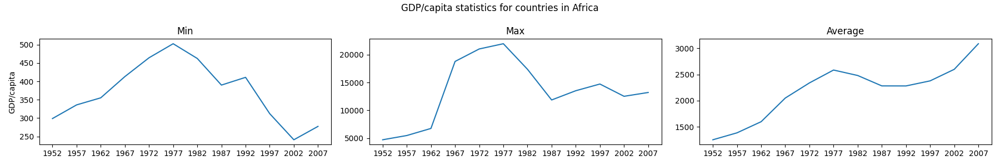

::::::::::::::::::::::::::::::::::::::: objectives

- Use a library function to get a list of filenames that match a wildcard pattern.
- Write a `for` loop to process multiple files.

::::::::::::::::::::::::::::::::::::::::::::::::::

:::::::::::::::::::::::::::::::::::::::: questions

- How can I do the same operations on many different files?

::::::::::::::::::::::::::::::::::::::::::::::::::

As a final piece to processing our GDP data, we need a way to get a list of all the files
in our `data` directory whose names start with `gapminder_` and end with `.csv`.
The following library will help us to achieve this:

```python
import glob
```

The `glob` library contains a function, also called `glob`, that finds files and directories whose names match a pattern.
We provide those patterns as strings: the character `*` matches zero or more characters, while `?` matches any one character.
We can use this to get the names of all the CSV files in the current directory:

```python
print(glob.glob('data/gapminder_*.csv'))
```

```output
['gapminder_gdp_americas.csv', 'gapminder_gdp_africa.csv', 'gapminder_gdp_europe.csv', 
'gapminder_gdp_asia.csv', 'gapminder_gdp_oceania.csv']
```

As these examples show, `glob.glob`'s result is a list of file and directory paths in arbitrary order.
This means we can loop over it to do something with each filename in turn.
In our case, the "something" we want to do is generate a set of plots for each file in our GDP dataset.


:::::::::::::::::::::::::::::::::::::::  challenge

## Determining Matches

Which of these files is *not* matched by the expression `glob.glob('data/*as*.csv')`?

1. `data/gapminder_gdp_africa.csv`
2. `data/gapminder_gdp_americas.csv`
3. `data/gapminder_gdp_asia.csv`

:::::::::::::::  solution

## Solution

1 is not matched by the glob.


:::::::::::::::::::::::::

::::::::::::::::::::::::::::::::::::::::::::::::::

:::::::::::::::::::::::::::::::::::::::  challenge

## Minimum File Size

Modify this program so that it prints the number of records in
the file that has the fewest records.

```python
import glob
import pandas as pd
fewest = ____
for filename in glob.glob('data/*.csv'):
    dataframe = pd.____(filename)
    fewest = min(____, dataframe.shape[0])
print('smallest file has', fewest, 'records')
```

Note that the [`DataFrame.shape()` method][shape-method]
returns a tuple with the number of rows and columns of the data frame.

:::::::::::::::  solution

## Solution

```python
import glob
import pandas as pd
fewest = float('Inf')
for filename in glob.glob('data/*.csv'):
    dataframe = pd.read_csv(filename)
    fewest = min(fewest, dataframe.shape[0])
print('smallest file has', fewest, 'records')
```

You might have chosen to initialize the `fewest` variable with a number greater than the numbers
you're dealing with, but that could lead to trouble if you reuse the code with bigger numbers.
Python lets you use positive infinity, which will work no matter how big your numbers are.
What other special strings does the [`float` function][float-function] recognize?


:::::::::::::::::::::::::

::::::::::::::::::::::::::::::::::::::::::::::::::


If we want to start by analyzing just the first three files in alphabetical order, we can use the
`sorted` built-in function to generate a new sorted list from the `glob.glob` output:

```python
import glob

import pandas as pd
import matplotlib.pyplot as plt

filenames = sorted(glob.glob('data/gapminder_*.csv'))
filenames = filenames[0:3]
for filename in filenames:
    print(filename)

    continent = filename[14:-4].capitalize()

    data_gdp = pd.read_csv(filename, index_col='country')

    fig = plt.figure(figsize=(18.0, 3.0))

    axes_1 = fig.add_subplot(1, 3, 1)
    axes_2 = fig.add_subplot(1, 3, 2)
    axes_3 = fig.add_subplot(1, 3, 3)

    axes_1.set_title('Min')
    axes_1.set_ylabel('GDP/capita')
    axes_1.plot(data_gdp.min(axis='rows'))

    axes_2.set_title('Max')
    axes_2.plot(data_gdp.max(axis='rows'))

    axes_3.set_title('Average')
    axes_3.plot(data_gdp.mean(axis='rows'))

    fig.suptitle('GDP/capita statistics for countries in ' + continent)
    fig.tight_layout()
    plt.show()
```

```output
data/gapminder_gdp_africa.csv
```

{alt='Output from the first iteration of the for loop. Three line graphs showing the yearly minimum, maximum and average GDP over the years for the countries in the first dataset.'}

```output
data/gapminder_gdp_americas.csv
```

{alt='Output from the first iteration of the for loop. Three line graphs showing the yearly minimum, maximum and average GDP over the years for the countries in the second dataset.'}

```output
data/gapminder_gdp_asia.csv
```

{alt='Output from the first iteration of the for loop. Three line graphs showing the yearly minimum, maximum and average GDP over the years for the countries in the third dataset.'}

The average plot generated for the Americas dataset looks a bit strange. How is it possible
that the average value across the years is flat?
Also, we find a similar behaviour for the minimum graph for the Asia dataset, where in this case it's always 0.

From inspecting the data we can see that some entries for the Asia dataset has a 0 value.
This may suggest that there were potential issues with data collection.
The Americas dataset, however, doesn't show any clear indication by visually inspecting the data, nevertheless, it seems very improbable that the average remained constant for the whole time.

:::::::::::::::::::::::::::::::::::::::  challenge

## Comparing Data

Write a program that reads in the regional data sets
and plots the average GDP per capita for each region over time
in a single chart.

:::::::::::::::  solution

## Solution

This solution builds a useful legend by using the [string `split` method][split-method] to
extract the `region` from the path 'data/gapminder\_gdp\_a\_specific\_region.csv'.

```python
import glob
import pandas as pd
import matplotlib.pyplot as plt
fig, ax = plt.subplots(1,1)
for filename in glob.glob('data/gapminder_gdp*.csv'):
    dataframe = pd.read_csv(filename)
    # extract <region> from the filename, expected to be in the format 'data/gapminder_gdp_<region>.csv'.
    # we will split the string using the split method and `_` as our separator,
    # retrieve the last string in the list that split returns (`<region>.csv`),
    # and then remove the `.csv` extension from that string.
    region = filename.split('_')[-1][:-4]
    dataframe.mean().plot(ax=ax, label=region)
plt.legend()
plt.show()
```

:::::::::::::::::::::::::

::::::::::::::::::::::::::::::::::::::::::::::::::


After spending some time investigating the different statistical plots, we gain some insight into the various datasets.

The datasets appear to fall into two categories:

- seemingly "normal" datasets but display suspicious average values (such as Americas)
- "bad" datasets that shows 0 for the minima across the years (maybe due to missing data?) for different countries each year.


:::::::::::::::::::::::::::::::::::::::: keypoints

- Use `glob.glob(pattern)` to create a list of files whose names match a pattern.
- Use `*` in a pattern to match zero or more characters, and `?` to match any single character.

::::::::::::::::::::::::::::::::::::::::::::::::::


[split-method]: https://docs.python.org/3/library/stdtypes.html#str.split
