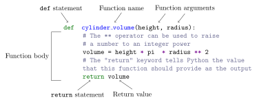
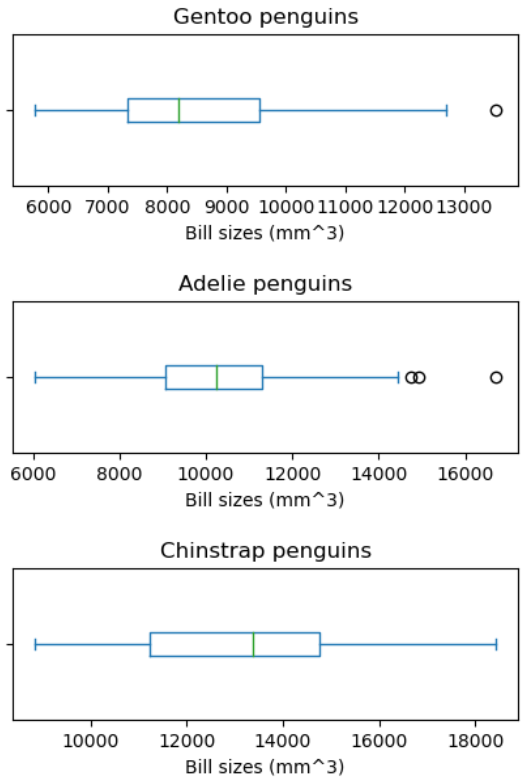

::::::::::::::::::::::::::::::::::::::: objectives

- Define a function that takes parameters.
- Return a value from a function.
- Test and debug a function.
- Set default values for function parameters.
- Explain why we should divide programs into small, single-purpose functions.

::::::::::::::::::::::::::::::::::::::::::::::::::

:::::::::::::::::::::::::::::::::::::::: questions

- How can I define new functions?
- What's the difference between defining and calling a function?
- What happens when I call a function?

::::::::::::::::::::::::::::::::::::::::::::::::::

::::::::::::::::::::::::::::::::::::::::::: prereq

In this lesson we are going to be using the data in the `penguin_data.csv` file, which is a subset of the freely available dataset [`palmerpenguins`](https://github.com/allisonhorst/palmerpenguins/tree/main).
This dataset contains the species, culmen length, culmen depth, flipper length and mass of 343 penguins observed on the Palmer archipelago, Antarctica.


If you are starting a new notebook, you'll need to `import` Pandas and load this data into a variable, which we will call `penguins`.
We have assigned each penguin a name, which we will use as the row labels (and pass to the `index_col` parameter).

We will also be making plots, so we'll need to import `matplotlib.pyplot` like we did in lesson 3.
And finally, we also need the mathematical constant $\pi$ (`pi`), which we can `import` from the `math` library that comes with Python.

```python
# Import Pandas like we did before
import pandas as pd
# Import matplotlib.pyplot so we can make plots
import matplotlib.pyplot as plt
# Import pi from the math library
# Using "from math import pi" means that we don't load in the entire math library - we only need pi!
from math import pi

penguins = pd.read_csv('data/penguin_data.csv', index_col='name')

# Display the value of pi
print("Pi is:", pi)
# Display the first 5 rows in the dataset
print("Our dataset looks like:")
print(penguins.head(5))
```

```output
Pi is: 3.141592653589793
Our dataset looks like:
                id    species  culmen depth (mm)  culmen length (mm)  \
name                                                                   
lyndale      N34A2     Gentoo               16.3                51.5   
drexel       N32A1     Adelie               16.6                35.9   
delaware     N56A2     Gentoo               16.0                48.6   
phillips     N20A2     Gentoo               16.8                49.8   
south shore  N65A2  Chinstrap               18.8                51.0   

             flipper length (mm)  mass (kg)  
name                                         
lyndale                    230.0       5.50  
drexel                     190.0       3.05  
delaware                   230.0       5.80  
phillips                   230.0       5.70  
south shore                203.0       4.10  
```

:::::::::::::::::::::::::::::::::::::::::::::::::::::::

Having recently returned from a research trip to Antarctica, a researcher has hypothesised that penguin species with larger bills are able to consume more food than those with smaller bills.
The trouble is, the data that's been collected doesn't record the information they want directly - we will need to infer this information from the data that has been recorded.

We're going to have to do a lot of calculations with the data to help justify this researcher's claims.
It would be helpful if we didn't have to manually type out these calculations *every time* we want to perform them.
This is where functions come in: given some *inputs*, they define a sequence of steps which produce an *output*.

::::::::::::::::::::::::::::::::::::::::::::::: callout

## Functions are like recipes

Python views functions in the same ways as humans might view recipes when cooking.
Given some ingredients (the inputs), you follow the recipe (the instructions/steps), to produce a meal (the output).
- You might decide to switch out the vegetables you're using, or switch chips for something like sweet potato fried, and so you get a different meal even if the *steps you take* to make the meal are the same.

You only have to look in one place for the recipe to know what you're doing. 
Similarly, functions let us write one set of instructions that can be run multiple times in our code.
This also helps if we find a bug in our instructions - we only have to change the instructions in one place (the function) rather than all over our notebook!

:::::::::::::::::::::::::::::::::::::::::::::::::::::::

The researcher informs us that we can treat the bill of a penguin as a cylinder, with the "depth" being the diameter of the cylinder and the "length" the height.
The volume of a cylinder is given by
$$ \text{cylinder volume} = \text{cylinder height} \times \pi \left(\text{cylinder radius} \right)^2. $$
This is not a simple calculation to write out every time we need to do it, and we will most likely want to do this calculation a lot in our analysis!
So we can define a _function_ that can perform this calculation for us:

```python
# Functions always start with "def", followed by the name of the function.
# After the name, we put in brackets the arguments that the function takes.
def cylinder_volume(height, radius):
    # The ** operator can be used to raise a number to an integer power
    volume = height * pi * radius** 2
    # The "return" keyword tells Python the value that this function should provide as the output
    return volume
```

{alt='Labeled parts of a Python function definition'}

- The function definition opens with the keyword `def` followed by the
name of the function (`cylinder_volume`) and a parenthesized list of parameter (or argument) names (`height, radius`). 
- The [body](../learners/reference.md#body) of the function is indented below the definition line. These are the statements (instructions) that are executed when it runs.
- The body concludes with a `return` keyword followed by the return value, which will be the function's output.

When we call the function, the values we pass to it are assigned to those variables so that we can use them inside the function.
Inside the function, we use a [return statement](../learners/reference.md#return-statement) to send a result back to whoever asked for it.
Let's try running our function:

```python
# The volume of a cylinder with radius 1 and height 1
# should be 1 * pi * 1 ** 2 = pi
cylinder_volume(1, 1)
```

This command should call our function, using "1" as the input for `height`, and "1" as the input for `radius`, and return the function value.
In fact, calling our own function is no different from calling any other function:

```python
print('cylinder with no height has volume:', cylinder_volume(0, 1))
print('cylinder with height 1 and radius 1 has volume:', cylinder_volume(1, 1))
```

```output
cylinder with no height has volume: 0.0
cylinder with height 1 and radius 1 has volume: 3.141592653589793
```

We've successfully called the function that we defined, and we have access to the value that we returned.

## Composing Functions

Now that we have a function to calculate the volume of a cylinder, we can start to estimate the bill sizes of our penguins.
From the researcher's explanation, the bill size of a penguin can be worked out as:
$$ \text{bill size} = \text{culmen height} \times \pi \left(\frac{\text{culmen depth}}{2} \right)^2, $$
since the culmen depth is the cylinder's diameter --- which is double the radius.

So how can we write out a function to estimate the bill size from the culmen length and culmen depth?
We could write out the formula above, but we don't need to.
Instead, we can [compose](../learners/reference.md#compose) our `cylinder_volume` function with a statement that divides the diameter by 2 to obtain the radius:

```python
def penguin_bill_size(culmen_length, culmen_depth):
    # Divide the culmen depth by two to get the "radius" to use
    culmen_radius = culmen_depth / 2
    # Now calculate the volume of the bill
    culmen_size = cylinder_volume(culmen_length, culmen_radius)
    return culmen_size

# Compute the bill size of the penguin 'phillips'
phillips_length = penguins.loc['phillips','culmen length (mm)']
phillips_depth = penguins.loc['phillips','culmen depth (mm)']
print('Penguin phillips has bill size', penguin_bill_size(phillips_length, phillips_depth), "mm^3")
```

```output
Penguin phillips has bill size 11039.204726337332 mm^3
```

This is our first taste of how larger programs are built: we define basic operations, then combine them in ever-larger chunks to get the effect we want.
Real-life functions will usually be larger than the ones shown here --- typically half a dozen to a few dozen lines --- but they shouldn't ever be much longer than that, or the next person who reads it won't be able to understand what's going on.

## Variable Scope

In composing our `cylinder_volume` function, we created variables *inside* of those functions --- `culmen_radius` and `culmen_size` inside `penguin_bill_size`, and `volume` within `cylinder_radius`.
We refer to these variables as [local variables](../learners/reference.md#local-variable) because they no longer exist once the function is done executing.
If we try to access their values outside of the function, we will encounter an error:

```python
print('The culmen_size was:', culmen_size)
```

```error
---------------------------------------------------------------------------
NameError                                 Traceback (most recent call last)
/tmp/ipykernel_8392/2249064020.py in <module>
----> 1 print('The culmen_radius was:', culmen_size)

NameError: name 'culmen_size' is not defined
```

If you want to reuse the bill size you've calculated, you can store the result of the function call in a variable:

```python
bill_size = penguin_bill_size(1, 2)
print('bill_size was:', bill_size)
```

```output
bill_size was: 3.141592653589793
```

The variable `bill_size`, being defined outside any function,
is said to be [global](../learners/reference.md#global-variable).

Inside a function, one can read the value of such global variables.
For example, our `cylinder_volume` function is able to read the value of `pi`, even though we didn't actually assign `pi` within the function!

```python
# Functions always start with "def", followed by the name of the function.
# After the name, we put in brackets the arguments that the function takes.
def cylinder_volume(height, radius):
    # Because pi is global, we can use it's value in this function
    print("This function knows the value of pi is", pi)
    # The ** operator can be used to raise a number to an integer power
    volume = height * pi * radius ** 2
    # The "return" keyword tells Python the value that this function should provide as the output
    return volume

volume = cylinder_volume(0, 0)
print("Volume was:", volume)
```

```output
This function knows the value of pi is 3.141592653589793
Volume was: 0.0
```

::::::::::::::::::::::::::::::::::::::::::::::::: callout

## Operating on dataframe columns

Our `penguin_bill_size` function performs well when we give it two individual numbers for the culmen length and depth.
But our dataframe has 343 penguins in it --- we don't want to call the function 343 times if we can avoid it!
Fortunately for us, dataframes are clever enough to allow us to "operate along columns".
If we want to do the _same_ calculation with all the values in two dataframe columns, we can just give our function the dataframe *columns* containing all the culmen lengths and culmen depths:

```python
bill_sizes = penguin_bill_size(penguins['culmen length (mm)'], penguins['culmen depth (mm)'])

print(bill_sizes)
```

This is an example of *vectorisation*; Python can perform the same command across a set of data much faster than it would if we called the `penguin_bill_size` 343 times on the individual culmen lengths and depths!

:::::::::::::::::::::::::::::::::::::::::::::::::::::::

## Tidying up

Now that we know how to wrap bits of code up in functions, we can make our analysis of the size of penguin bills easier to read and reuse.
The researcher was interested in whether different penguin species have different bill sizes, and a natural way to test this is to produce a box plot for each of the species we have data on.
First, let's make a `visualise_bill_sizes` function that generates a box plot for a single species of penguin:

```python
def visualise_bill_sizes(penguin_data, species_name):
    # First, we need to check if we have any records of the penguin species in the dataframe we were given
    if species_name in penguin_data['species'].values:
        # We have some data on that species of penguin!

        # Use loc to filter for the rows that correspond to that penguin species
        this_species = penguins.loc[penguins['species'] == species_name]

        # Now let's work out the bill sizes of these penguins
        bill_sizes = penguin_bill_size(this_species['culmen length (mm)'], this_species['culmen depth (mm)'])

        # Now let's make a plot of these bill sizes
        fig = plt.figure(figsize=(10., 3.))
        bill_sizes.plot.box(vert=False)
        plt.title(species_name + " penguins")
        plt.xlabel("Bill sizes (mm^3)")
        plt.show()
    else:
        # We don't have any data on that species of penguin!
        print("There is no data on penguin species:", species_name)
```

Wait! 
Didn't we forget to specify what this functions should return? Well, we didn't. 
In Python, functions are not required to include a `return` statement and can be used for the sole purpose of grouping together pieces of code that conceptually do one thing. 
In such cases, function names usually describe what they do, *e.g.* `visualise_bill_sizes`.

Notice that rather than jumbling this code together in one giant `for` loop, we can now read and reuse both ideas separately.
We can produce a box plot for each species of penguin using a `for` loop, and by putting our function inside it!

```python
# Load our data
penguins = pd.read_csv('data/penguin_data.csv', index_col='name')

# Get Python to work out what the names of the penguin species are
unique_species = penguins['species'].unique

for species in unique_species:
    visualise_bill_sizes(penguins, species)
```

{alt='Box plots of the distribution of bill sizes for different species of penguins'}

By giving our functions human-readable names, we can more easily read and understand what is happening in the `for` loop.
Even better, if at some later date we want to use either of those pieces of code again, we can do so in a single line.

:::::::::::::::::::::::::::::::::::::::  challenge

## Combining Strings

"Adding" two strings produces their concatenation: `'a' + 'b'` is `'ab'`.
Write a function called `fence` that takes two parameters called `original` and `wrapper` and returns a new string that has the wrapper character at the beginning and end of the original.
A call to your function should look like this:

```python
print(fence('name', '*'))
```

```output
*name*
```

:::::::::::::::  solution

## Solution

```python
def fence(original, wrapper):
    return wrapper + original + wrapper
```

:::::::::::::::::::::::::

::::::::::::::::::::::::::::::::::::::::::::::::::

:::::::::::::::::::::::::::::::::::::::  challenge

## Return versus print

Note that `return` and `print` are not interchangeable.
`print` is a Python function that *prints* data to the screen.
It enables us, *users*, see the data.
`return` statement, on the other hand, makes data visible to the program.
Let's have a look at the following function:

```python
def add(a, b):
    print(a + b)
```

**Question**: What will we see if we execute the following commands?

```python
A = add(7, 3)
print(A)
```

:::::::::::::::  solution

## Solution

Python will first execute the function `add` with `a = 7` and `b = 3`,
and, therefore, print `10`. However, because function `add` does not have a
line that starts with `return` (no `return` "statement"), it will, by default, return
nothing which, in Python world, is called `None`. Therefore, `A` will be assigned to `None`
and the last line (`print(A)`) will print `None`. As a result, we will see:

```output
10
None
```

:::::::::::::::::::::::::

::::::::::::::::::::::::::::::::::::::::::::::::::

:::::::::::::::::::::::::::::::::::::::  challenge

## Rescaling an Array

Our researcher has decided that it would be much clearer if all the bill sizes were rescaled so that the corresponding values in the `'species'` column lie in the range 0.0 to 1.0.
Write a new function `rescaled_bill_sizes` that:
- Takes a dataframe of penguins as it's input.
- Calculates the bill sizes of all the penguins in the dataframe, then rescales the values to be in this range.
- Returns the rescaled bill sizes as the output.

Hint: If `L` and `H` are the lowest and highest values of the original bill sizes, then the replacement for a bill size `size` should be `(size-L) / (H-L)`.

:::::::::::::::  solution

## Solution

```python
def rescaled_bill_sizes(data):
    bill_sizes = penguin_bill_size(data['culmen length (mm)'], data['culmen depth (mm)'])
    L = bill_sizes.min()
    H = bill_sizes.max()
    rescaled_bill_sizes = (bill_sizes - L) / (H - L)
    return rescaled_bill_sizes
```

:::::::::::::::::::::::::

::::::::::::::::::::::::::::::::::::::::::::::::::

:::::::::::::::::::::::::::::::::::::::  challenge

## Variables Inside and Outside Functions

What does the following piece of code display when run --- and why?

```python
f = 0
k = 0

def f2k(f):
    k = ((f - 32) * (5.0 / 9.0)) + 273.15
    return k

print(f2k(8))
print(f2k(41))
print(f2k(32))

print(k)
```

:::::::::::::::  solution

## Solution

```output
259.81666666666666
278.15
273.15
0
```

`k` is 0 because the `k` inside the function `f2k` doesn't know
about the `k` defined outside the function. When the `f2k` function is called,
it creates a [local variable](../learners/reference.md#local-variable)
`k`. The function does not return any values
and does not alter `k` outside of its local copy.
Therefore the original value of `k` remains unchanged.
Beware that a local `k` is created because `f2k` internal statements
*affect* a new value to it. If `k` was only `read`, it would simply retrieve the
global `k` value.

:::::::::::::::::::::::::

::::::::::::::::::::::::::::::::::::::::::::::::::

::::::::::::::::::::::::::::::::::::::::::::: challenge

# Producing a scatter plot

Write a function `plot_bill_size_vs_flipper` that:
- Takes the penguin data and the name of a species as its arguments
- Produces a scatter plot for that species; with the flipper size on the x-axis and bill size on the y-axis
- Shows this plot on the screen.

Hint: `plt.scatter(x_data, y_data)` produces a scatter plot.

::::::::::::::::::::::::: solution

```python
def plot_bill_size_vs_flipper(penguin_data, species_name):
    # First, we need to check if we have any records of the penguin species in the dataframe we were given
    if species_name in penguin_data['species'].values:
        # We have some data on that species of penguin!

        # Use loc to filter for the rows that correspond to that penguin species
        this_species = penguins.loc[penguins['species'] == species_name]

        # Now let's work out the bill sizes of these penguins
        bill_sizes = penguin_bill_size(this_species['culmen length (mm)'], this_species['culmen depth (mm)'])

        # Now let's make a plot of these bill sizes
        fig = plt.figure(figsize=(5., 5.))
        plt.scatter(this_species['flipper length (mm)'], bill_sizes)
        plt.title(species_name + " penguins")
        plt.xlabel("Flipper length (mm)")
        plt.ylabel("Bill sizes (mm^3)")
        plt.show()
    else:
        # We don't have any data on that species of penguin!
        print("There is no data on penguin species:", species_name)
```


::::::::::::::::::::::::::::::::::

:::::::::::::::::::::::::::::::::::::::::::::::::::::::

:::::::::::::::::::::::::::::::::::::::: keypoints

- Define a function using `def function_name(parameter)`.
- The body of a function must be indented.
- Call a function using `function_name(value)`.
- Variables defined within a function can only be seen and used within the body of the function.
- Variables created outside of any function are called global variables.
- Within a function, we can access global variables.
- If we want to do the same calculation on all entries in our columns, we can pass the dataframe columns as the inputs to a function.

::::::::::::::::::::::::::::::::::::::::::::::::::


